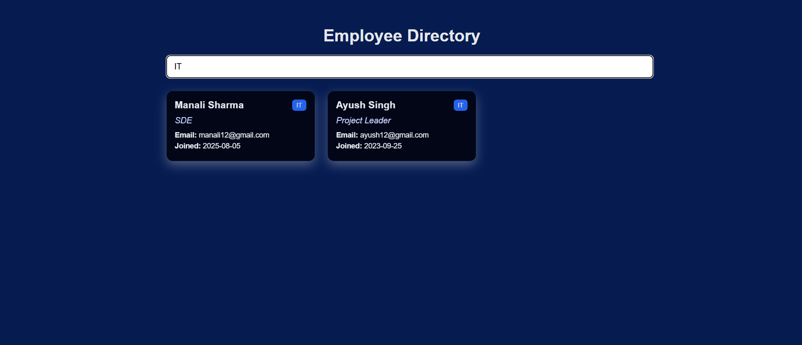

# Employee Directory CaseStudy

A full-stack employee management directory system with search functionality. Supports case-insensitive search by name (partial match) or department (exact match). Features loading states, debounced search, and clean employee card UI. Includes .env.example for safe environment configuration.


## Tech Stack

**Client:** 

• React  
• Vite  
• Axios  
• Component-based architecture

**Server:** 

• Python  
• FastAPI  
• SQLAlchemy ORM

**Database:** 

• MySQL


## Project Structure

```text
├── frontend/
│   ├── components/
│   │   ├── SearchBar.jsx
│   │   ├── EmployeeList.jsx
│   │   ├── EmployeeCard.jsx
│   │   └── SkeletonCard.jsx
│   ├── services/
│   │   └── employeeService.js
│   ├── EmployeePage.jsx
│   └── .env.example
|
├── backend/
│   ├── routers/
│   │   └── employee_router.py
│   ├── services/
│   │   └── employee_service.py
│   ├── database.py
│   ├── main.py
│   ├── models.py
│   ├── schemas.py
│   └── .env.example
|
└── README.md
```


## Features

> **Frontend Requirements Fulfilled**  \

     1. Performance-Oriented Search :
       - Search input is debounced (500ms)
       - API calls are not triggered for every keystroke

     2. API State Handling : 
       - Loading state → Skeleton cards
       - Success state → Employee list
       - Empty state → “No employees found”

    3. Component Structure & Reusability : 
      - Reusable components: SearchBar , EmployeeList , EmployeeCard , SkeletonCard
      - API logic separated into services/
      - UI components remain clean and focused

> **Backend Requirements Fulfilled**

    1. *Database Design & Connection : 
      - MySQL chosen for structured relational data
      - SQLAlchemy ORM used for: Safety , Scalability , Maintainability
      - Employees table: Optimized for search queries , Easy to extend (add create/update later)

    2. Employee Search API
      - Endpoint : GET /employees?search=IT
         [
            { "id":1,  
              "name":"Manali Sharma",  
              "email":"manali12@gmail.com",  
              "department":"IT",  
              "designation":"SDE",  
              "date_of_joining":"2025-08-05"
            },  
            { "id":7,  
              "name":"Ayush Singh",
              "email":"ayush12@gmail.com",
              "department":"IT",
              "designation":"Project Leader",  
              "date_of_joining":"2023-09-25"
            }
        ]
         
      - Search Logic :  
        ➤  First tries exact department match (case-insensitive)
        ➤  If no department match → partial name search
        ➤  Result limit applied for performance
        
    3. Validation & Error Handling :  
      - Empty or short queries return empty results
      - Controlled responses with proper HTTP behavior


## Database Design

CREATE TABLE employees (  
  id INT AUTO_INCREMENT PRIMARY KEY,  
  name VARCHAR(100),  
  email VARCHAR(100),  
  department VARCHAR(100),  
  designation VARCHAR(100),  
  date_of_joining DATE,  
  INDEX idx_name (name),  
  INDEX idx_department (department)  
);


## Frontend and Backend Setup

> **Frontend Setup**

    1. Installing all Dependencies : 
        cd frontend  
        npm install  

    2. Setting up .env file :  
        VITE_API_BASE_URL=Url of backend API server
        I have created .env file but not sharing secrets here and have used .env.example file.  
        You can setup your BASE_URL like this 
        Eg : VITE_API_BASE_URL=http://localhost:port_number   

    3. Run the frontend :  
       npm run dev
       
       The frontend will start on: http://localhost:port_number

> **Backend Setup**

    1. Installing all Dependencies : 
        cd backend  
        python -m venv venv
        source venv/bin/activate   # On Windows: venv\Scripts\activate  
        python -m pip install -r requirements.txt  

    2. Setting up .env file :  
        DB_HOST=Database host name  
        DB_PORT=Database port  
        DB_USER=Database user name  
        DB_PASSWORD=Database password  
        DB_NAME=Database name  

        I have created .env file but not sharing secrets here and have used .env.example file.  
        You can setup your DB by entering your credentials  

    3. Run the backend :  
       python -m uvicorn app.main:app --reload  

       The backend API will start on: http://localhost:port_number
       

## Search Performance Optimization & Efficiency

  - The frontend uses debounced search input, ensuring API requests are only triggered after the user stops typing, significantly reducing unnecessary network calls.  
  - A minimum query length constraint is enforced to prevent meaningless database queries and reduce backend load.  
  - On the backend, search logic is optimized by separating concerns: 
    - Exact match is used for department searches to ensure accuracy and prevent irrelevant results.  
    - Partial match is used for name searches to provide flexible user experience.
  - The backend first attempts a department match and only falls back to name search if no department results are found, avoiding expensive wildcard queries when possible.  
  - Search results are explicitly limited, reducing query execution time and minimizing response payload size.


## Execution Results  
Search By Name  
  
  
  

Search By Department  
  
  
  


No Employee found  

